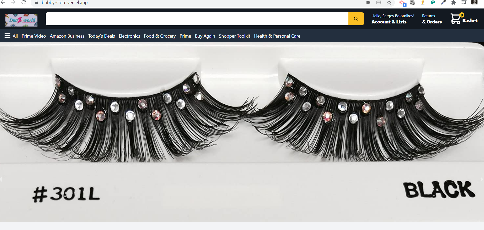
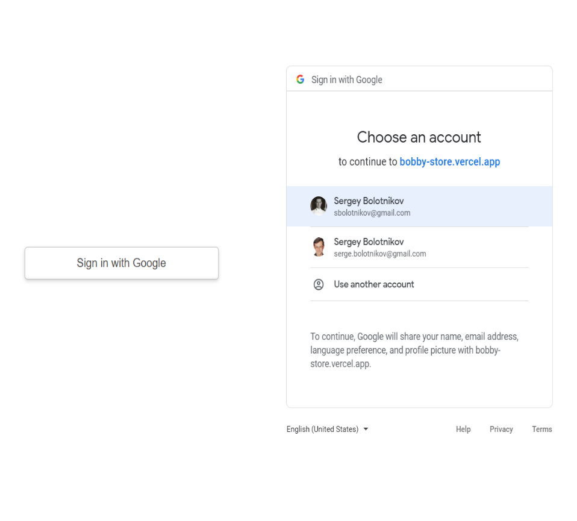
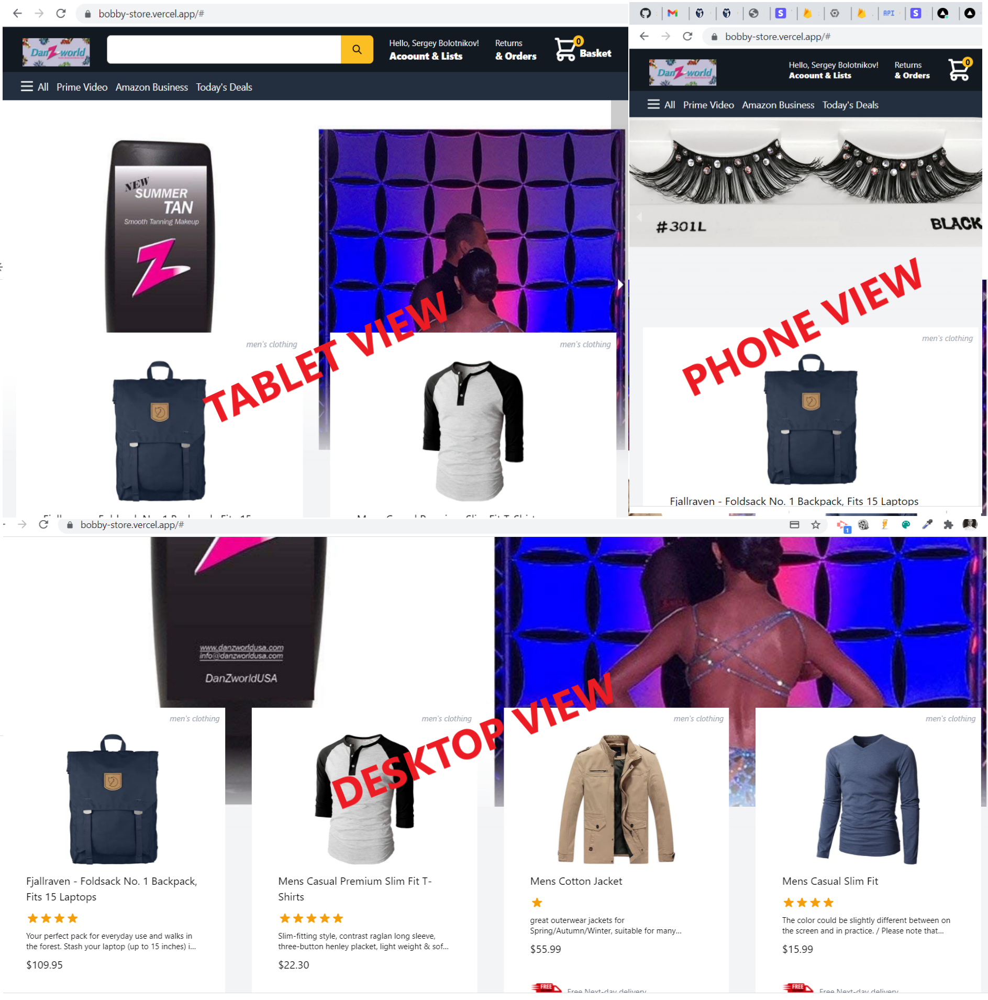
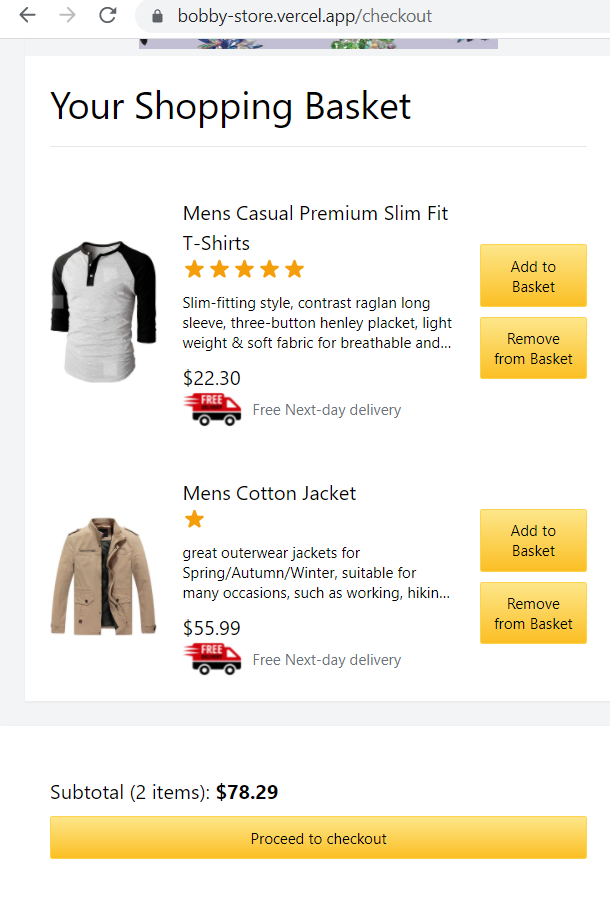
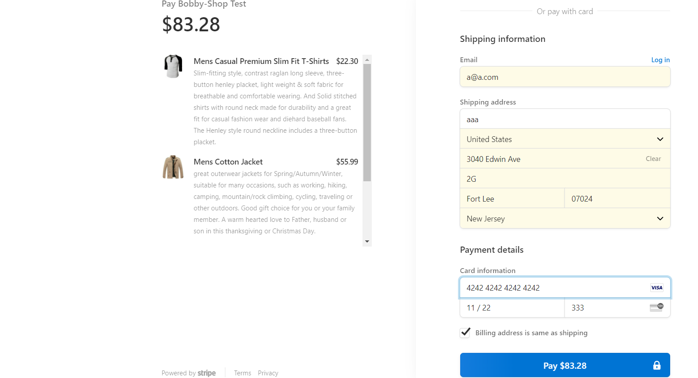
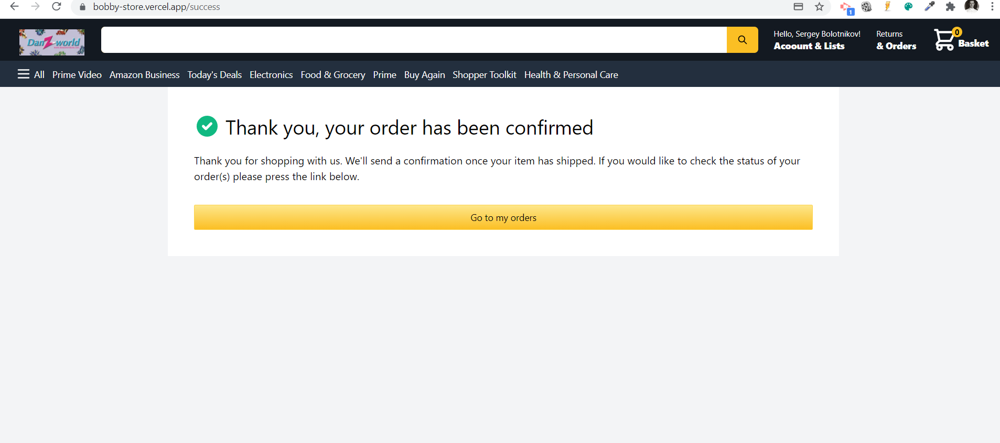
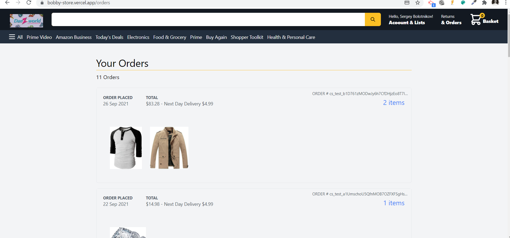

# bobby-store 
## Description 
Web-store app allowes to register with google, choose products to basket, checkout on stripe, check on existing orders from the database. 
This project is a fully functioned and deployed full-stack responsive app. Created on Next.js with NextAuth, Redux, Taillwindcss, Firebase, Stripe checkout.

## Table of Contents
* [Installation](#installation)
* [Usage](#usage)
* [Contributing](#contributing)
* [Tests](#tests)
* [License](#license)
* [Questions](#questions)
* [Review](#review)
## Installation 
### Using npm

Run commands

1) ```npm install```


2) ```npm run dev```


### Or using yarn

Run commands 

1) ```npm install --global yarn```

2) ```yarn install```

3) ```yarn run dev```

you need also install stripe CLI if you want to run it locally.
after installation you need to run in Comand prompt

```stripe listen --forward-to localhost:3000/api/webhook```
## Usage 

Please check video guide at [youtube](https://youtu.be/6TWGMW7uzoE).
There is a link to deployed app bellow.

Greeting screen:
 

Sign in screenshots:

 

Responsive views on different devices:
 

Mobile basket view:

 

Stripe checkout page:
 

Successful order completion
 

Orders made screen:
 


## Contributing 
Use video guide from [Sonny Sangha on Youtube](https://www.youtube.com/playlist?list=PLf16UKl7nR5AF9k4ckTG82onvpAv1NAE7)
## License 
 Licensed under MIT License. 
## Tests 
none
## Questions 
 You can see more of my Projects on my [GitHub profile](https://github.com/sbolotnikov) 

 Contact [sbolotnikov](mailto:sbolotnikov@gmail.com) 
## Review 
  * Here is this repo link: https://github.com/sbolotnikov/bobby-store
 
  * Link: [bobby-store](https://bobby-store.vercel.app/)